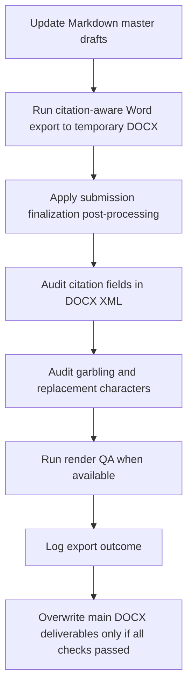

# management-empirical-writer

`management-empirical-writer` is a reusable Codex skill for empirical paper work in management, strategy, innovation, governance, digital transformation, ESG, and adjacent business-research domains.

It is designed for projects that need:

- bilingual Chinese and English manuscript maintenance
- empirical-evidence-grounded drafting
- citation-safe writing with Zotero or MCP citekeys
- Markdown-first source management
- Word submission packaging with explicit safety gates

## What This Skill Does

This skill is the manuscript workflow controller.

It helps the user:

- initialize a paper project structure
- inspect readiness before drafting
- align theory, data, variables, and journal target
- build a literature pool before writing
- draft chapter by chapter rather than in one unsafe pass
- keep Chinese and English versions factually aligned
- package final Word deliverables without losing citation integrity
- finalize paired Chinese and English submission Word files through a gated delivery chain

This skill is not a paper-specific storage location. Do not place datasets, private PDFs, raw Stata outputs, or confidential project materials inside the skill repository.

## Best Use Cases

Use this skill when the project involves one or more of the following:

- listed-firm or panel-data empirical research
- Stata-based tables, logs, and regression evidence
- management or business-journal writing
- bilingual Chinese and English output
- Zotero or cite-rag-mcp citation workflows
- Word submission files that must remain editable and citation-safe

## Standard Project Layout

```text
paper-project/
├── data/
├── stata/
├── results/
├── journal_samples/
│   ├── reference_cn.docx
│   └── reference_en.docx
├── literature/
├── zotero/
├── drafts/
│   ├── cn/
│   │   ├── paper_cn.md
│   │   └── paper_cn.docx
│   └── en/
│       ├── paper_en.md
│       └── paper_en.docx
├── tables/
├── figures/
├── logs/
└── versions/
```

## Workflow Overview

The skill uses a gated workflow:

1. Stage 0: project initialization
2. Stage 1: cognitive alignment
3. Stage 2: writing plan
4. Stage 3: chapter drafting
5. Stage 4: consistency review
6. Stage 5: pre-submission packaging

The core rule is simple:

- draft from evidence
- confirm before expanding
- export only after checks

## Formal Delivery Safety Valve

This repository now enforces a stronger formal-delivery rule set so later projects do not repeat the same Word-export mistakes.

### Non-negotiables

- Markdown is the only source of truth for manuscript content.
- User-facing final Word files must never be produced by a plain `pandoc` overwrite alone.
- Citation-managed manuscripts must use a citation-aware export path for formal delivery.
- Word post-processing must not destroy citation fields.
- If citation audit or garbling audit fails, the main `docx` files must not be overwritten.
- Temporary Word build artifacts must be cleaned up after delivery.
- Chinese and English final DOCX files must be finalized through the same rule set unless the user explicitly requests a controlled divergence.
- Figure, table, formula, pagination, and caption repairs must not be performed by directly patching an older final DOCX and calling it the new delivery.

### Working Draft vs Formal Delivery

`working-draft` mode:

- temporary local preview
- may use `pandoc`
- must write to temporary files such as `paper_cn.tmp.docx`

`formal-delivery` mode:

- user-facing final manuscript delivery
- must use the citation-aware pipeline when citekeys or Word fields are expected
- must pass audits before replacing the main `docx`
- must finalize both Chinese and English outputs under one synchronized delivery pass

## Formal Delivery Flow



### Delivery Pass Conditions

Formal delivery passes only when all of the following are true:

- source Markdown is current
- citation-aware export succeeded
- citation fields still exist after post-processing
- no `�` replacement characters appear in `word/document.xml`
- no suspicious `????` garbling markers appear
- Chinese and English outputs both pass the same finalization checks
- export result is logged in `logs/word-export-log.md`

### Delivery Failure Examples

Formal delivery is blocked if any of the following occurs:

- citation fields are flattened into plain text
- old variable names reappear in final Word files
- figure captions lose numbering or merge into the interpretation paragraph
- equations degrade into raw pseudo-formula strings
- chapter-open page breaks are missing
- figures or tables drift into structurally unsafe layout

## Citation Integrity

This skill assumes citation integrity is mandatory.

- never fabricate citekeys
- never fabricate bibliography records
- never cite metadata-only records for precise theoretical or measurement claims without confirmation
- do not treat a plain-text reference list as equivalent to preserved Word citation fields

For Word outputs that are expected to preserve Zotero-style fields, the minimum XML audit markers are:

- `ADDIN ZOTERO_ITEM`
- `CSL_CITATION`

## Literature and Evidence Rules

Before drafting, the project should have:

- writing-critical literature imported or confirmed
- valid citekeys for chapter-critical references
- a literature pool strong enough to support the manuscript
- an empirical evidence map
- an empirical results inventory

The skill prioritizes:

- recent high-quality English papers
- target-journal and benchmark-paper fit
- real variable-measurement support
- explicit use or accounting of all empirical outputs

## Tooling Expectations

At initialization, the workflow should check:

```bash
git --version
pandoc --version
python3 --version
```

If any tool is missing, the skill must not silently pretend the related workflow passed.

## Relationship to Other Skills

This skill controls the manuscript workflow.

When Word layout repair is needed, it should delegate final Word-structure normalization to `chinese-word-pro`.

That means:

- `management-empirical-writer` decides whether formal delivery is allowed
- `chinese-word-pro` repairs and verifies submission Word structure without breaking citation fields

## Bilingual Final Delivery Route

For submission-ready bilingual manuscripts:

1. Maintain `paper_cn.md` and `paper_en.md` as the only content sources.
2. Export temporary Chinese and English DOCX files via the citation-aware route.
3. Finalize both DOCX files with the Word-finalization authority.
4. Audit both outputs for citation safety and structural integrity.
5. Remove temporary exports.
6. Replace the main deliverables only after both outputs pass.

For the reusable command template used to run this chain in a real project, see:

- `references/word-export-rules.md`

For a project-level shell wrapper that only requires changing one root-path variable, start from:

- `assets/formal-delivery-template.sh`

## Common Failure Modes This Skill Is Meant to Prevent

- exporting final Word files with plain `pandoc` and losing citation fields
- overwriting the main `docx` before checking garbling
- repairing one language version but forgetting to synchronize the other
- treating an older healthy DOCX as the new editing baseline
- drafting without enough literature or variable-measurement support
- silently omitting robustness, mechanism, heterogeneity, or endogeneity outputs
- letting Chinese and English versions drift apart in facts or findings

## Repository Contents

- `SKILL.md`: main workflow rules and gate logic
- `references/`: checklists, alignment templates, export rules, and citation rules
- `assets/`: reusable writing templates
- `agents/openai.yaml`: metadata for the skill surface
