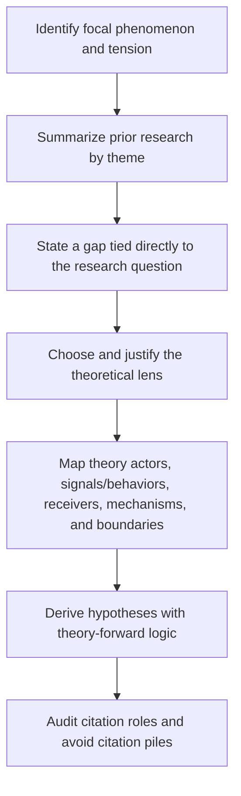
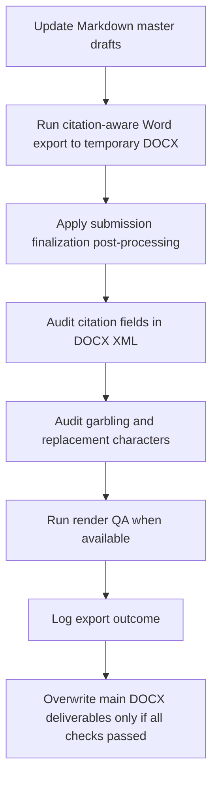
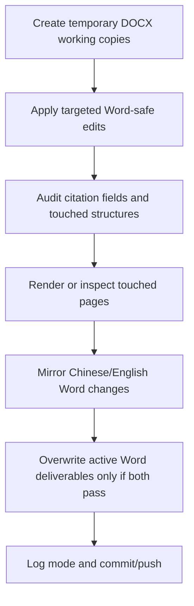

# management-empirical-writer

`management-empirical-writer` is a reusable Codex skill for empirical paper work in management, strategy, innovation, governance, digital transformation, ESG, and adjacent business-research domains.

It is designed for projects that need:

- bilingual Chinese and English manuscript maintenance
- empirical-evidence-grounded drafting
- citation-safe writing with Zotero or MCP citekeys
- Markdown-first source management
- Word submission packaging with explicit safety gates

## What This Skill Does

This skill is the manuscript workflow controller.

It helps the user:

- initialize a paper project structure
- inspect readiness before drafting
- align theory, data, variables, and journal target
- write the first two chapters with a clear division between problem framing and theory development
- build a literature pool before writing
- draft chapter by chapter rather than in one unsafe pass
- keep Chinese and English versions factually aligned
- package final Word deliverables without losing citation integrity
- finalize paired Chinese and English submission Word files through a gated delivery chain

This skill is not a paper-specific storage location. Do not place datasets, private PDFs, raw Stata outputs, or confidential project materials inside the skill repository.

## Best Use Cases

Use this skill when the project involves one or more of the following:

- listed-firm or panel-data empirical research
- Stata-based tables, logs, and regression evidence
- management or business-journal writing
- bilingual Chinese and English output
- Zotero or cite-rag-mcp citation workflows
- Word submission files that must remain editable and citation-safe

## Standard Project Layout

```text
paper-project/
├── data/
├── stata/
├── results/
├── journal_samples/
│   ├── reference_cn.docx
│   └── reference_en.docx
├── literature/
├── zotero/
├── drafts/
│   ├── cn/
│   │   ├── paper_cn.md
│   │   └── paper_cn.docx
│   └── en/
│       ├── paper_en.md
│       └── paper_en.docx
├── tables/
├── figures/
├── logs/
└── versions/
```

## Workflow Overview

The skill uses a gated workflow:

1. Stage 0: project initialization
2. Stage 1: cognitive alignment
3. Stage 2: writing plan
4. Stage 3: chapter drafting
5. Stage 4: consistency review
6. Stage 5: pre-submission packaging

The core rule is simple:

- draft from evidence
- confirm before expanding
- export only after checks

## First-Two-Chapter Writing Route

When working on Introduction or Theory Development, the skill must use `references/introduction-theory-writing-rules.md`.

The route is:



Default division of labor:

- Introduction: explains why the problem matters and previews the study.
- Theory Development: explains why the proposed relationships should hold.

Citation rule:

- Use citations to support specific claims.
- Normal citation groups should contain 1-3 references.
- Larger groups should be split by claim function unless explicitly justified.

## Formal Delivery Safety Valve

This repository now enforces a stronger formal-delivery rule set so later projects do not repeat the same Word-export mistakes.

## Manuscript Lifecycle Modes

Use two lifecycle modes instead of one rigid source rule.

### Mode A: Markdown-first drafting

Use this mode while the paper is still being planned, structurally rewritten, expanded, translated, or rebuilt.

For bilingual empirical-paper projects, use the following default hierarchy unless the user explicitly approves a different workflow:


```text
paper_cn.md    = content mother manuscript
paper_cn.docx  = formatted derivative of paper_cn.md
paper_en.md    = paragraph-by-paragraph translation derivative of paper_cn.md
paper_en.docx  = formatted derivative of paper_en.md
```

This hierarchy is a drafting and rebuild gate, not an eternal rule.

Rules:

- Write and revise the Chinese Markdown mother manuscript first.
- Synchronize the English Markdown in the same work round, paragraph by paragraph or block by block.
- Generate both Word files only after the two Markdown files are synchronized.
- Do not let the English draft become an independent manuscript with different structure, evidence order, formula numbering, figure numbering, table numbering, citation set, variable names, or empirical interpretations.
- Do not postpone English synchronization until the end of a large rewrite. Delayed synchronization is treated as a workflow failure because it creates avoidable drift and rework.

Before formal delivery, audit the four files for:

- heading hierarchy
- paragraph/block order
- formulas and formula numbers
- tables and table numbers
- figures and figure numbers
- citation keys and reference set
- variable names and display labels
- empirical result interpretations
- Word derivative timestamps and source consistency

If the audit fails in Markdown-first mode, return to the Chinese Markdown mother manuscript and resynchronize the derivatives before any final Word overwrite.

### Mode B: Word-only refinement

Use this mode after the manuscript has become a stable paper and the remaining work is mainly final polish.

The agent should recommend switching to Word-only refinement before another full Markdown-to-Word rebuild when:

- the section structure, empirical results, hypotheses, tables, figures, and formulas are already stable
- the requested work is local wording, reference enrichment, formula repair, figure/table/caption polishing, abstract/cover layout, or pagination
- previous Markdown-to-Word rebuilds have repeatedly damaged formulas, figures, tables, citation fields, or page layout

After the user confirms this mode:

- Chinese and English Word files are the active manuscripts.
- Markdown files become archival snapshots, not mandatory live sources.
- Do not require four-file synchronization for every small edit.
- Do not run full Markdown-to-Word export unless the user explicitly requests a full rebuild or the paper re-enters structural drafting.
- Do not repair citation problems by rebuilding from Markdown unless the user explicitly approves that risk. In Word-only refinement, citation repair must work on temporary Word copies and preserve the current title, formulas, figures, tables, captions, and pagination.
- Make localized edits in the Chinese Word file first, then mirror them into the English Word file as a translation-equivalent counterpart.
- Preserve live citation fields, native equations, figure/table layout, and already verified formatting through targeted Word-safe edits.

### Non-negotiables

- In Markdown-first mode, Markdown is the source of truth for manuscript content.
- In Word-only refinement mode, the active Word files are the working manuscripts and Markdown is archival unless the user explicitly returns to a full rebuild.
- User-facing final Word files must never be produced by a plain `pandoc` overwrite alone.
- Citation-managed manuscripts must use a citation-aware export path for formal delivery.
- Word post-processing must not destroy, flatten, reduce, or move citation fields.
- Citation-field audits must compare field counts and citekey counts before and after post-processing or Word-only refinement edits.
- If citation audit or garbling audit fails, the main `docx` files must not be overwritten.
- Temporary Word build artifacts must be cleaned up after delivery.
- Chinese and English final DOCX files must be finalized through the same rule set unless the user explicitly requests a controlled divergence.
- In Markdown-first mode, figure, table, formula, pagination, and caption repairs must not be performed by directly patching an older final DOCX and calling it the new delivery.
- In Word-only refinement mode, targeted direct DOCX repair is allowed only through temporary working copies, citation-field-safe edits, bilingual Word-pair audit, and visual/structural QA.
- In the standard Markdown-first four-file workflow, `paper_cn.md` is the content mother manuscript, `paper_cn.docx` is its formatted derivative, `paper_en.md` is the translation derivative, and `paper_en.docx` is the formatted derivative of the English Markdown file.
- If those four files are not synchronized to the same substantive manuscript version in Markdown-first mode, formal rebuild delivery is blocked.

### Working Draft vs Formal Delivery

`working-draft` mode:

- temporary local preview
- may use `pandoc`
- must write to temporary files such as `paper_cn.tmp.docx`
- may run Word finalization with `--citation-policy warn` only when explicitly labeled as a recovery or working draft

`formal-delivery` mode:

- user-facing final manuscript delivery
- must use the citation-aware pipeline when citekeys or Word fields are expected
- must pass audits before replacing the main `docx`
- must finalize both Chinese and English outputs under one synchronized delivery pass
- must run Word finalization with `--citation-policy strict`
- must be blocked if the citation-aware export backend cannot create live citation fields
- in Markdown-first mode, must treat Chinese Markdown as the mother manuscript by default when the user has designated it as the base manuscript
- in Word-only refinement mode, must treat the Chinese and English Word files as the active synchronized pair and preserve Markdown as archival

`recovery-layout` mode:

- used after file loss, broken Zotero state, or temporary citation-export failure
- may repair typography, figures, tables, formulas, captions, and pagination
- in Markdown-first mode, must preserve Markdown as the source of truth
- in Word-only refinement mode, must preserve the active Word files as the working manuscripts
- must clearly report that the resulting Word file is not a formal submission file if citation fields are absent
- must record the missing citation-field issue in the delivery log

## Formal Delivery Flow

Markdown-first rebuild flow:



Word-only refinement flow:



For Zotero-based projects, insert a preflight gate before citation-aware export:

```bash
python3 "$HOME/.codex/skills/chinese-word-pro/scripts/zotero_preflight_recover.py" \
  --collection-key "<ZOTERO_COLLECTION_KEY>" \
  --timeout 90 \
  --strict
```

If this gate opens Zotero but cannot make the collection or Better BibTeX route usable, use Computer Use once to select the collection in the Zotero UI, then rerun the preflight. If it still fails, formal delivery must stop.

### Delivery Pass Conditions

Formal delivery passes only when all of the following are true:

- in Markdown-first mode, source Markdown is current
- in Word-only refinement mode, the active Chinese and English Word files are synchronized and Markdown is explicitly treated as archival
- citation-aware export succeeded
- citation fields still exist after post-processing
- no `�` replacement characters appear in `word/document.xml`
- no suspicious `????` garbling markers appear
- Chinese and English outputs both pass the same finalization checks
- numbered formulas use native Word formula objects, with the formula body centered and the number right-aligned on the same formula paragraph
- table-based numbered formula containers are absent unless an explicit fallback exception is approved and logged
- figures are inline, captions are independent and numbered, and image aspect ratios are preserved
- ordinary body paragraphs are left-aligned unless a journal profile explicitly requires another layout
- academic table-cell paragraphs are centered and explicitly zero-indented at OOXML level, including `firstLineChars=0`
- in Markdown-first mode, the four-file package is synchronized: Chinese Markdown current, Chinese Word derived from it, English Markdown translation-equivalent to it, English Word derived from the English Markdown file
- in Word-only refinement mode, the Chinese and English Word pair remains translation-equivalent and no full Markdown sync is required for localized polish
- export result is logged in `logs/word-export-log.md`

### Delivery Failure Examples

Formal delivery is blocked if any of the following occurs:

- citation fields are flattened into plain text
- Zotero or Better BibTeX cannot be reached before citation-aware export
- cite-rag-mcp or the approved citation-aware Word export route fails with a missing dependency or missing file
- new references were added but no live-citation smoke test can generate fields for them
- old variable names reappear in final Word files
- figure captions lose numbering or merge into the interpretation paragraph
- equations degrade into raw pseudo-formula strings
- formula numbers appear below, centered under, or separated from the formula body
- numbered formulas silently fall back to table-based layout without an approved exception
- figures are floating, clipped, stretched out of aspect ratio, or resized merely to fill page whitespace
- academic table cells inherit body first-line indentation or WPS-visible two-character indentation
- table-cell paragraphs are not explicitly zero-indented and centered in the final DOCX XML
- chapter-open page breaks are missing
- figures or tables drift into structurally unsafe layout

## Citation Integrity

This skill assumes citation integrity is mandatory.

- never fabricate citekeys
- never fabricate bibliography records
- never cite metadata-only records for precise theoretical or measurement claims without confirmation
- do not treat a plain-text reference list as equivalent to preserved Word citation fields

For Word outputs that are expected to preserve Zotero-style fields, the minimum XML audit markers are:

- `ADDIN ZOTERO_ITEM`
- `CSL_CITATION`
- real Word field-code structure such as `w:fldChar` and `w:instrText`
- for display-formatted delivery, zero visible unresolved citekey placeholders such as `[@...]` in `w:t` text
- for display-formatted delivery, a non-empty bibliography/reference list consistent with the de-duplicated citekey set
- for Zotero-refresh-ready delivery, the priority is that fields can be refreshed by Zotero/Word without rebuilding the manuscript from Markdown
- for Zotero-refresh-ready delivery, citekey placeholders inside live field display results may be acceptable, but citekeys outside fields are not acceptable
- for Word-only refinement, field count and citekey count must remain stable unless the user intentionally adds or removes citations

Do not treat `ADDIN ZOTERO_ITEM` or `CSL_CITATION` alone as proof of success. A broken DOCX may retain Zotero metadata strings while the field is not refresh-ready. If the user's goal is Zotero one-click updating, audit refresh readiness rather than forcing formatted author-year display.

Recommended checker:

```bash
python3 "$HOME/.codex/skills/chinese-word-pro/scripts/audit_zotero_fields.py" \
  --docx "<candidate.docx>" \
  --mode strict
```

For citation density:

- use 1 to 3 references for precise claims
- use 3 to 5 references for broad literature-synthesis claims
- split citation groups above 5 references by argumentative function rather than deleting useful references solely to reduce the count

## Literature and Evidence Rules

Before drafting, the project should have:

- writing-critical literature imported or confirmed
- valid citekeys for chapter-critical references
- a literature pool strong enough to support the manuscript
- an empirical evidence map
- an empirical results inventory

The skill prioritizes:

- recent high-quality English papers
- target-journal and benchmark-paper fit
- real variable-measurement support
- explicit use or accounting of all empirical outputs

For variable measurement, this skill treats `understanding the formula` and `having publishable literature backing` as two separate requirements. A measurement statement is not ready for manuscript drafting unless both conditions are satisfied, except in the rare case of a strictly confirmed self-developed measure that is transparently logged as such.

## Tooling Expectations

At initialization, the workflow should check:

```bash
git --version
pandoc --version
python3 --version
```

If any tool is missing, the skill must not silently pretend the related workflow passed.

## Relationship to Other Skills

This skill controls the manuscript workflow.

When Word layout repair is needed, it should delegate final Word-structure normalization to `chinese-word-pro`.

That means:

- `management-empirical-writer` decides whether formal delivery is allowed
- `chinese-word-pro` repairs and verifies submission Word structure without breaking citation fields

For formula-bearing manuscripts, this delegation is not optional. Formal delivery should explicitly require the downstream `Formula Finalization Pipeline` from `chinese-word-pro`:

- formula inventory
- inline symbol renderer
- OMML equation compiler
- formula delivery audit

The expected final visual contract is now fixed: native Word formula block, formula body visibly centered, equation number on the same formula paragraph and right-aligned. Overlong formulas should be fitted or natively wrapped before any fallback is considered. Table-based numbered formula containers are controlled recovery exceptions, not a normal formal-delivery strategy.

This requirement is meant to be general across projects, so future manuscripts do not regress when they introduce new variables, longer regression equations, or additional measurement formulas.

For submission-ready Word files, delegation also includes the downstream Figure Gate and Paragraph/Table Geometry Gate:

- Figure Gate: keep figures inline, preserve image aspect ratios, center figure paragraphs, and keep figure captions independent and numbered.
- Paragraph/Table Geometry Gate: keep ordinary body paragraphs left-aligned, center captions, center academic table-cell text, vertically center cells, remove fixed row-height clipping, and explicitly write zero table-cell indentation at OOXML level.

The table-cell rule is deliberately strict because Chinese Word/WPS can reapply inherited body first-line indentation inside cells unless `left`, `right`, `firstLine`, and `firstLineChars` are all neutralized in the DOCX XML.

## Bilingual Final Delivery Route

For submission-ready bilingual manuscripts:

1. Maintain `paper_cn.md` and `paper_en.md` as the only content sources.
2. Export temporary Chinese and English DOCX files via the citation-aware route.
3. Finalize both DOCX files with the Word-finalization authority.
   This includes the `chinese-word-pro` Formula Finalization Pipeline: formula inventory, inline symbol renderer, OMML equation compiler, and formula delivery audit.
   It also includes the `chinese-word-pro` Figure Gate and Paragraph/Table Geometry Gate for inline figures, captions, paragraph alignment, and table-cell indentation.
4. Audit both outputs for citation safety and structural integrity.
5. Remove temporary exports.
6. Replace the main deliverables only after both outputs pass.

For the reusable command template used to run this chain in a real project, see:

- `references/word-export-rules.md`

For a project-level shell wrapper that only requires changing one root-path variable, start from:

- `assets/formal-delivery-template.sh`

## Empirical Figure Handoff

Before Results, Robustness, Mechanism, Moderation, or Heterogeneity prose uses a figure, the project should already have a writing-ready bilingual figure package from `empirical-analysis`:

```text
figures/data/<figure_id>_plotdata.csv
figures/cn/<figure_id>_cn.png
figures/en/<figure_id>_en.png
figures/manifest/figure_manifest.md
```

This prevents the manuscript workflow from discovering too late that English figures still contain Chinese text or that Word inserted the wrong language variant.

Rules:

- Figures are generated once from shared plotting data into paired Chinese and English outputs.
- The Chinese manuscript only references `figures/cn/*_cn.png`.
- The English manuscript only references `figures/en/*_en.png`.
- Figure IDs and captions are stable before Word export.
- Raw Stata graphs can be visual benchmarks, but they are not the final bilingual deliverables by default.

## Common Failure Modes This Skill Is Meant to Prevent

- exporting final Word files with plain `pandoc` and losing citation fields
- overwriting the main `docx` before checking garbling
- repairing one language version but forgetting to synchronize the other
- fixing display equations but forgetting explanation paragraphs that still expose `Y_it`, `CR_it`, `Resilienceit`, `w1`, or other pseudo-formula residue
- leaving long equations as one unbroken line so the formula overflows the page or pushes the number out of place
- allowing orphan equation-number-only paragraphs to survive after finalization
- editing one of the four manuscript files independently and letting it drift away from the Chinese Markdown mother manuscript
- delaying English synchronization until the end of a large rewrite and then trying to reconstruct alignment from memory
- generating English figures by cropping, copying, or relabeling Chinese figures instead of drawing from shared plotting data
- treating an older healthy DOCX as the new editing baseline
- drafting without enough literature or variable-measurement support
- silently omitting robustness, mechanism, heterogeneity, or endogeneity outputs
- letting Chinese and English versions drift apart in facts or findings

## Repository Contents

- `SKILL.md`: main workflow rules and gate logic
- `references/`: checklists, alignment templates, export rules, and citation rules
- `assets/`: reusable writing templates
- `agents/openai.yaml`: metadata for the skill surface
